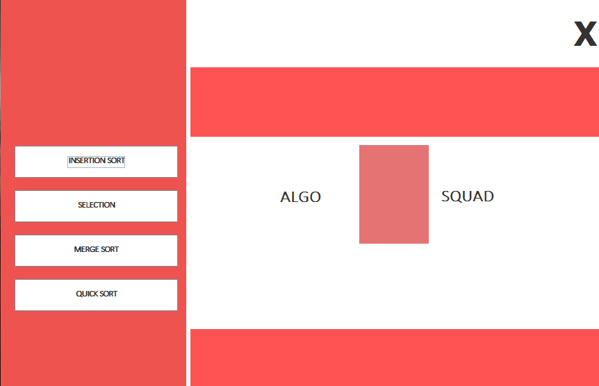
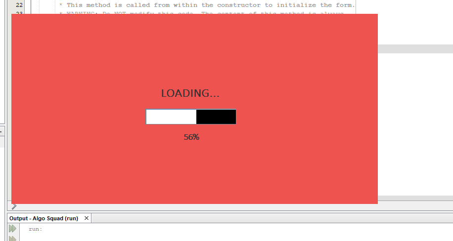
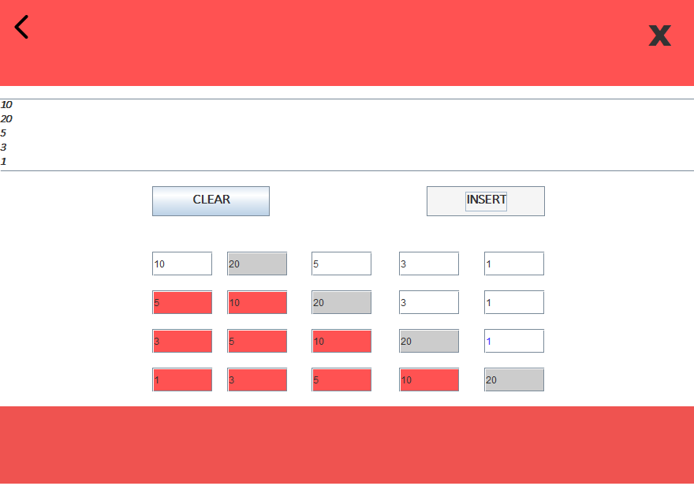

# This project is a java swing application which consists of four sorting algorithm:
         - Insertion sort
         - Selection sort
         - Quick sort
         - Merge sort
 
 # The project strats with a splash screen
 
 ### In this application we can perform those four sorting algorithm and for **Insertion** and **selection** sorting algorithm we can see the simulation of sorting for 5 elements

